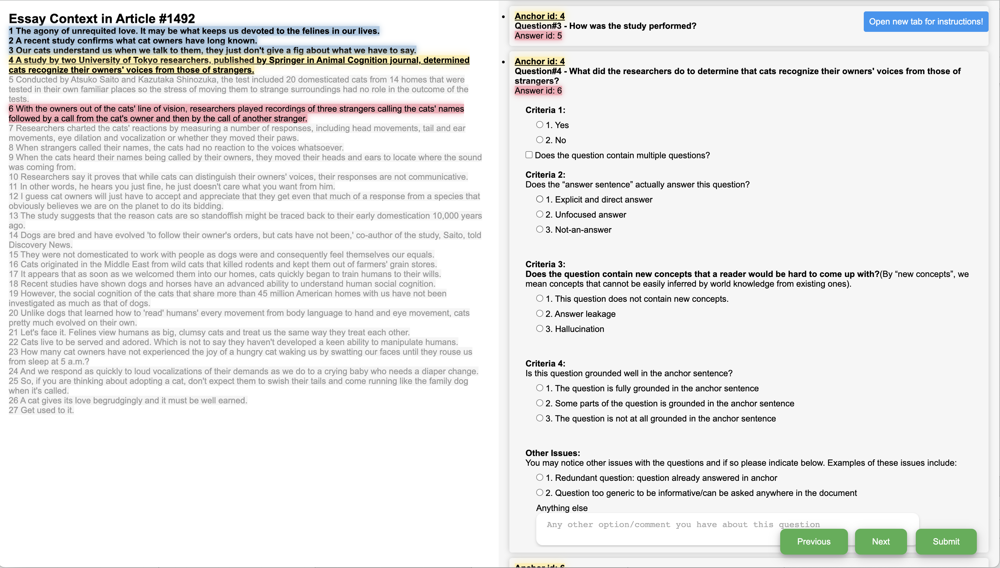

# QUD-eval-data-collection-flask
Welcome to the data collection UI repository for the EMNLP 2023 paper, "QUDeval: The Evaluation of Questions Under Discussion Discourse Parsing." 

**The main repo for it is under [QUD eval](https://github.com/lingchensanwen/QUDeval).**
This is just a repo for our data collection framework.

**Authors:** [Yating Wu](http://lingchensanwen.github.io), [Ritika Mangla](https://ritikamangla01.netlify.app), [Greg Durrett](https://www.cs.utexas.edu/~gdurrett/), and [Junyi Jessy Li](https://jessyli.com)


If you find our work useful or relevant to your research, please consider citing our paper. 
```bibtex
@inproceedings{wu2023qudeval,
    title={QUDeval: The Evaluation of Questions Under Discussion Discourse Parsing},
    author={Wu, Yating and Mangla, Ritika and Durrett, Greg and Li, Junyi Jessy},
    booktitle={EMNLP 2023},
    pages={to appear},
    year={2023}
}

```


We use flask to implement this.



We collect four criteria to evaluate how good a qud is. And we collect code from annotators and use them to match with our database.

We highlight important parts of QUD (anchor, answer) and greyed out things else. We also provide detailed instruction. We check if all evaluation is done for each question and will blue things to reduce the load for annotators.

You need to set the url to your database url under app.py.

You can install the dependency from <code>conda env create -f environment.yml -p xxx </code>
Run <code>flask run</code>, you will host a webpage for your data collection. In our implementation, we use heroku to host it. 
